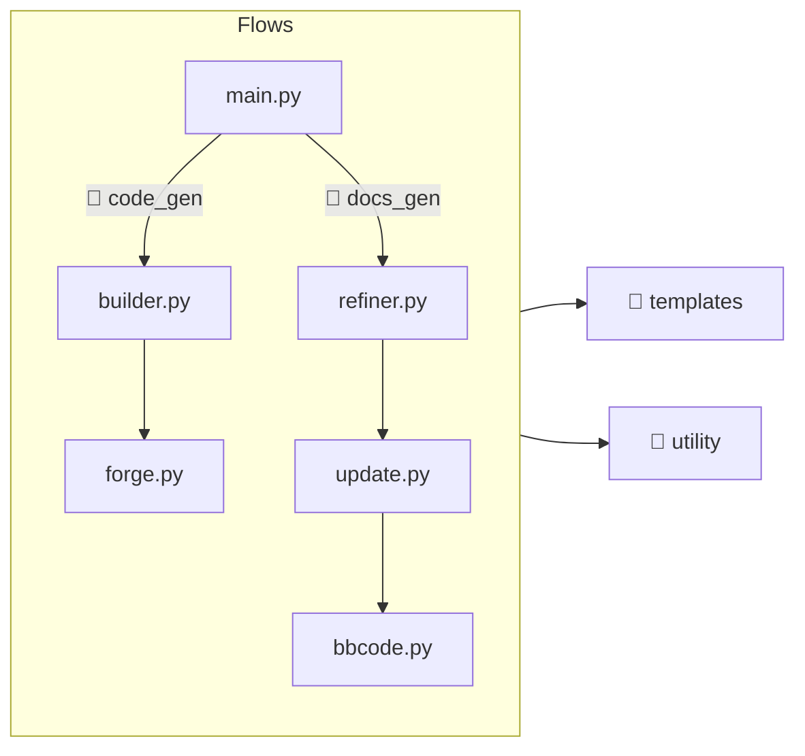

# Coding
All the important code is written in Python (inside `scripts`) and this code is responsible for generating the GDExtension code (inside `src`) and documentation (inside `doc_classes`).  

!!! warning
    Modifying files in `src`/`doc_classes` is a waste of time because they are recreated every time that we run the Python script.  

The directory follows this structure:  

## Project Tree
```
.
├── code_gen
│   └── Generator for GDExtension code (C++)
├── docs_gen
│   └── Generator for GDExtension docs (XML)
├── templates
│   └── Functions to generate specific strings
├── utility
│   └── Code to help both generators
└── main.py
    └── Entry point
```

## Executing
The entry point (`main.py`) accept the following arguments: `--code` or `--docs`.  

Which means that you can execute in one of the following ways:  

```bash
# Generate GDExtension code.
python scripts/main.py --code

# Generate GDExtension documentation.
python scripts/main.py --docs

# Generate both.
python scripts/main.py --code --docs
```

Now that the project is ~*somehow*~ complete, the last is one the most used.  

## Reading Flow
