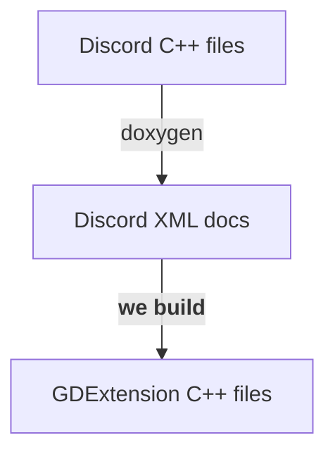
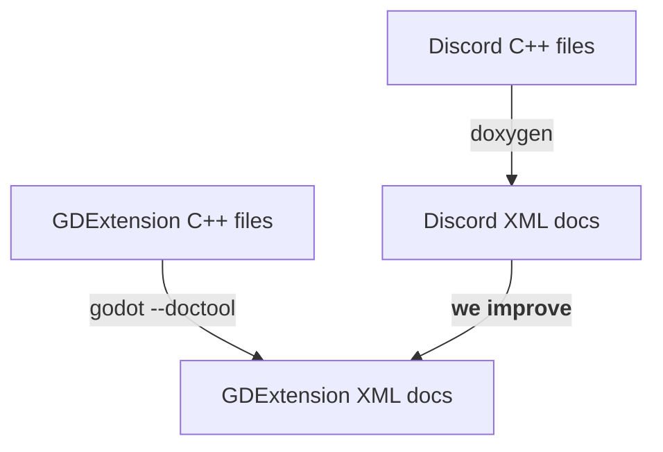
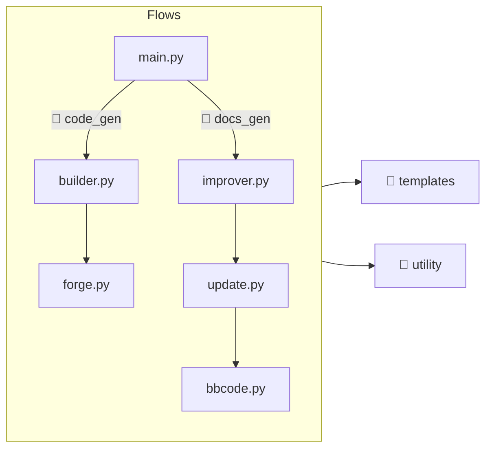

# Coding
All the important code is written in Python (inside `scripts`) and this code is responsible for generating the GDExtension code (inside `src`) and documentation (inside `doc_classes`).  

!!! warning
    Modifying files in `src`/`doc_classes` is a waste of time because they are recreated every time that we run the Python script.  

## Main Logic
We use [Doyxgen](https://www.doxygen.nl/) to generate a XML documentation of the Discord code, which we read to obtain information about how to build our GDExtension code... That's it!  



Now we need to create the GDExtension documentation!  

For this we use Godot [`--doctool`](https://docs.godotengine.org/en/stable/tutorials/editor/command_line_tutorial.html#command-line-reference) command, which generate the base documentation for all GDExtension classes. Then we improve the documentation using information collected from Discord code.  



## Entry Point
The `main.py` accept the following arguments: `--code` or `--docs`.  

Which means that you can execute in one of the following ways:  

```bash
# Generate GDExtension code.
python scripts/main.py --code

# Generate GDExtension documentation.
python scripts/main.py --docs

# Generate both.
python scripts/main.py --code --docs
```

Now that the project is ~*somehow*~ complete, the last is one the most used.  

## Reading Flow


### 📂 code_gen
Responsible for generating GDExtension code (C++).  

- `builder.py`: Create `.cpp` and `.h` files
- `forger.py`: Create code snippets

### 📂 docs_gen
Responsible for generating GDExtension docs (XML).  

- `improver.py`: Update `.xml` files
- `update.py`: Update elements content
- `bbcode.py`: Adapt documentation text to bbcode

### 📂 templates
Functions that return specific strings for code/docs/file.  

```python
def get_xxx(a: str, b: str, ...) -> str
```

??? example

    Template for `register_types.cpp`

    ```python
    def get_register_types_cpp(register_abstracts: str, register_runtimes: str) -> str:
        return f"""
    #include "register_types.h"
    #include "discord_classes.h"
    #include "discord_enum.h"
    #include "gdextension_interface.h"
    #include "godot_cpp/core/class_db.hpp"
    #include "godot_cpp/core/defs.hpp"
    #include "godot_cpp/godot.hpp"

    using namespace godot;

    void initialize_module(ModuleInitializationLevel p_level) {{
        if (p_level != MODULE_INITIALIZATION_LEVEL_SCENE) {{
            return;
        }}

        // Abstracts.
        {register_abstracts}

        // Runtimes.
        {register_runtimes}
    }}

    void uninitialize_module(ModuleInitializationLevel p_level) {{
        if (p_level != MODULE_INITIALIZATION_LEVEL_SCENE) {{
            return;
        }}
    }}

    extern "C" {{
    // Initialization.
    GDExtensionBool GDE_EXPORT
    initialize_extension(GDExtensionInterfaceGetProcAddress p_get_proc_address,
            const GDExtensionClassLibraryPtr p_library,
            GDExtensionInitialization *r_initialization) {{
        godot::GDExtensionBinding::InitObject init_obj(p_get_proc_address, p_library,
                r_initialization);

        init_obj.register_initializer(initialize_module);
        init_obj.register_terminator(uninitialize_module);
        init_obj.set_minimum_library_initialization_level(
                MODULE_INITIALIZATION_LEVEL_SCENE);

        return init_obj.init();
    }}
    }}
    """
    ```

### 📂 utility
Code to help both generators.  