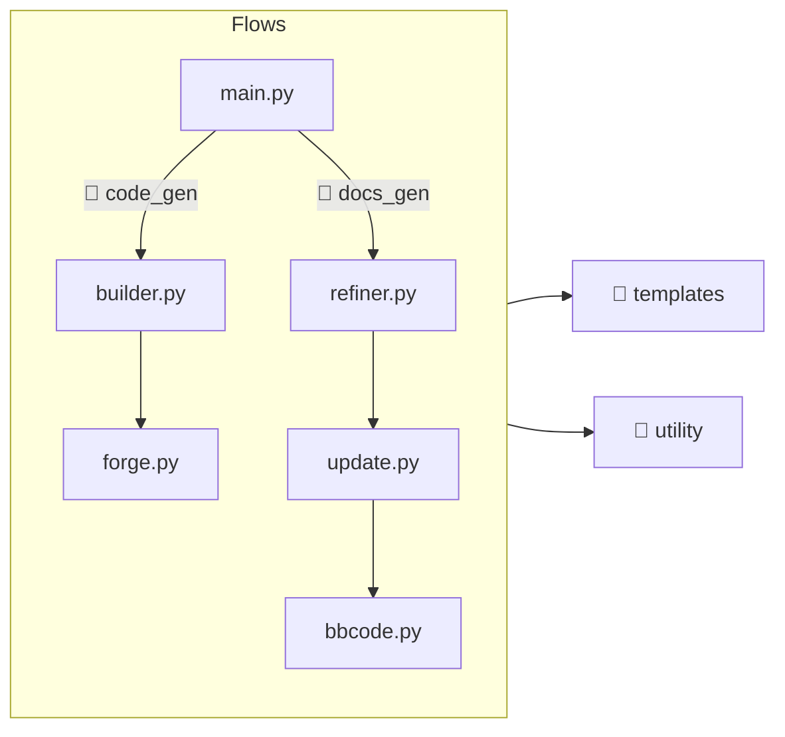

# Coding
All the important code is written in Python (inside `scripts`) and this code is responsible for generating the GDExtension code (inside `src`) and documentation (inside `doc_classes`).  

!!! warning
    Modifying files in `src`/`doc_classes` is a waste of time because they are recreated every time that we run the Python script.  

## Project Tree
```
.
├── 📂 code_gen
│   └── Generator for GDExtension code (C++)
├── 📂 docs_gen
│   └── Generator for GDExtension docs (XML)
├── 📂 templates
│   └── Functions to generate strings
├── 📂 utility
│   └── Code to help both generators
└── 📄 main.py
    └── Entry point
```

## Entry Point
The `main.py` accept the following arguments: `--code` or `--docs`.  

Which means that you can execute in one of the following ways:  

```bash
# Generate GDExtension code.
python scripts/main.py --code

# Generate GDExtension documentation.
python scripts/main.py --docs

# Generate both.
python scripts/main.py --code --docs
```

Now that the project is ~*somehow*~ complete, the last is one the most used.  

## Reading Flow


### 📂 code_gen
- `builder.py`: Create `.cpp` and `.h` files
- `forger.py`: Create code snippets

### 📂 docs_gen
- `refiner.py`: Update `.xml` files
- `update.py`: Update elements content
- `bbcode.py`: Adapt documentation text to bbcode

### 📂 templates
Simple functions to return specific strings for code/docs/file.  

```python
def get_xxx(a: str, b: str, ...) -> str
```

??? example

    Template for `register_types.cpp`

    ```python
    def get_register_types_cpp(register_abstracts: str, register_runtimes: str) -> str:
        return f"""
    #include "register_types.h"
    #include "discord_classes.h"
    #include "discord_enum.h"
    #include "gdextension_interface.h"
    #include "godot_cpp/core/class_db.hpp"
    #include "godot_cpp/core/defs.hpp"
    #include "godot_cpp/godot.hpp"

    using namespace godot;

    void initialize_module(ModuleInitializationLevel p_level) {{
        if (p_level != MODULE_INITIALIZATION_LEVEL_SCENE) {{
            return;
        }}

        // Abstracts.
        {register_abstracts}

        // Runtimes.
        {register_runtimes}
    }}

    void uninitialize_module(ModuleInitializationLevel p_level) {{
        if (p_level != MODULE_INITIALIZATION_LEVEL_SCENE) {{
            return;
        }}
    }}

    extern "C" {{
    // Initialization.
    GDExtensionBool GDE_EXPORT
    initialize_extension(GDExtensionInterfaceGetProcAddress p_get_proc_address,
            const GDExtensionClassLibraryPtr p_library,
            GDExtensionInitialization *r_initialization) {{
        godot::GDExtensionBinding::InitObject init_obj(p_get_proc_address, p_library,
                r_initialization);

        init_obj.register_initializer(initialize_module);
        init_obj.register_terminator(uninitialize_module);
        init_obj.set_minimum_library_initialization_level(
                MODULE_INITIALIZATION_LEVEL_SCENE);

        return init_obj.init();
    }}
    }}
    """
    ```

### 📂 utility
This directory is very complex because attempt to solve multiple problems that happened during the main flows.  