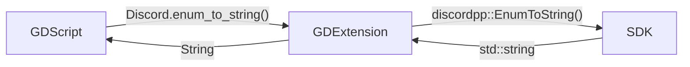

# Development

## GDExtension
This GDExtension is just a wrapper around [Discord Social SDK](https://discord.com/developers/docs/discord-social-sdk/overview), which means that you call the GDExtension method and it calls the SDK method.  



Basically, this GDExtension job is convert between Godot variables and C++ variables.  

For example, when you pass a [`String`](https://docs.godotengine.org/en/stable/classes/class_string.html) to a GDExtension method, it will convert to [`std::string`](https://en.cppreference.com/w/cpp/string/basic_string.html) before passing to the SDK method. And the opposite convertion needs to happen when returning from SDK.  

## Project Tree
```
.
├── demo/
│   └── Godot project containing the addon, examples and tests
├── doc_classes/
│   └── Project classes documentation
├── godot-cpp/
│   └── C++ bindings for GDExtension API
├── include/
│   └── Discord headers
├── lib/
│   └── Discord libs
├── scripts/
│   └── Python scripts
└── src/
    └── GDExtension source codes and headers
```

From the directories above, only two are edited manually: `demo` and `scripts`.  