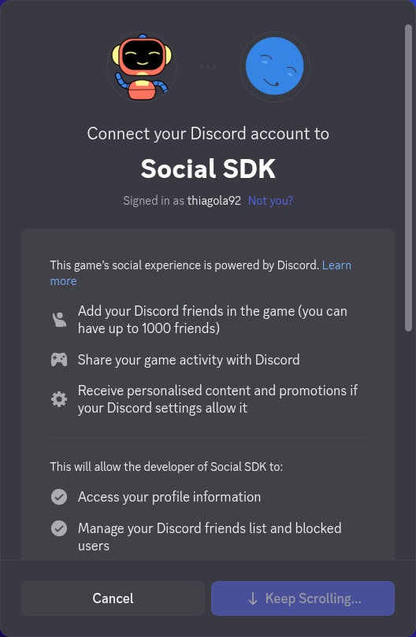

# Account Linking
!!! warning
	Prerequisites:

	- [Core](core.md)

	Any code from the prerequisites can be **omitted** to make it easier to read. If you do want the complete code, look at the [repository examples](https://github.com/thiagola92/discord-social-sdk/tree/main/demo/examples).  

## From your game
Linking the user account to your application require the user permission, so we will need to provide details when requesting permission. We will use `DiscordAuthorizationArgs` for this.  

```gdscript title="GDScript" linenums="1" hl_lines="10 12-14"
extends Node


var application_id: int = 123456789012345678

var client := DiscordClient.new()


func _ready() -> void:
	var args := DiscordAuthorizationArgs.new()
	
	args.set_client_id(application_id)
	args.set_scopes(DiscordClient.get_default_presence_scopes())
	args.set_code_challenge(code_verifier.challenge())


func _process(_delta: float) -> void:
	Discord.run_callbacks()
```

??? question "`client.set_application_id()` vs `args.set_client_id()`"

	Did you noticed that I didn't use `client.set_application_id()`? Instead, I used `args.set_client_id()`.  
	
	Later we will call `client.connect_discord()`, then Discord will look for the Application ID in `client` and `args`.  

    If you **don't** intend to call `client.connect_discord()` but still wants to use others features from the SDK, then `client.set_application_id()` is very useful (I don't know when is better to use `args.set_client_id()`).  

I will not cover security details, so you just need to know that later we will use `DiscordAuthorizationCodeVerifier` to verify the response from Discord.  

```gdscript title="GDScript" linenums="1" hl_lines="8 13"
extends Node


var application_id: int = 123456789012345678

var client := DiscordClient.new()

var code_verifier: DiscordAuthorizationCodeVerifier


func _ready() -> void:
	var args := DiscordAuthorizationArgs.new()
	code_verifier = client.create_authorization_code_verifier()
	
	args.set_client_id(application_id)
	args.set_scopes(DiscordClient.get_default_presence_scopes())
	args.set_code_challenge(code_verifier.challenge())


func _process(_delta: float) -> void:
	Discord.run_callbacks()
```

To request the user for permission we use `client.authorize()`, which should prompt the user for permissions in Discord (or browser if Discord is not open).  

!!! warning
	**Linux:** The SDK doesn't find the Discord from Flatpak/Snap, so it will always open the browser.

```gdscript title="GDScript" linenums="1" hl_lines="19 26-31"
extends Node


var application_id: int = 123456789012345678

var client := DiscordClient.new()

var code_verifier: DiscordAuthorizationCodeVerifier


func _ready() -> void:
	var args := DiscordAuthorizationArgs.new()
	code_verifier = client.create_authorization_code_verifier()
	
	args.set_client_id(application_id)
	args.set_scopes(DiscordClient.get_default_presence_scopes())
	args.set_code_challenge(code_verifier.challenge())
	
	client.authorize(args, _on_authorization_response)


func _process(_delta: float) -> void:
	Discord.run_callbacks()


func _on_authorization_response(result: DiscordClientResult, code: String, redirect_uri: String) -> void:
	if not result.successful():
		print("❌ Authorization Error: %s" % result.error())
		return
	
	print("✅ Authorization successful! Next step: exchange code for an access token")
```

  

Now that we got permission from the user, we can continue with the security procedures to gain our token.  

```gdscript title="GDScript" linenums="1" hl_lines="32 35-47"
extends Node


var application_id: int = 123456789012345678

var client := DiscordClient.new()

var code_verifier: DiscordAuthorizationCodeVerifier


func _ready() -> void:
	var args := DiscordAuthorizationArgs.new()
	code_verifier = client.create_authorization_code_verifier()
	
	args.set_client_id(application_id)
	args.set_scopes(DiscordClient.get_default_presence_scopes())
	args.set_code_challenge(code_verifier.challenge())
	
	client.authorize(args, _on_authorization_response)


func _process(_delta: float) -> void:
	Discord.run_callbacks()


func _on_authorization_response(result: DiscordClientResult, code: String, redirect_uri: String) -> void:
	if not result.successful():
		print("❌ Authorization Error: %s" % result.error())
		return
	
	print("✅ Authorization successful! Next step: exchange code for an access token")
	client.get_token(application_id, code, code_verifier.verifier(), redirect_uri, _on_token_received)


func _on_token_received(
	result: DiscordClientResult,
	access_token: String,
	_refresh_token: String,
	token_type: DiscordAuthorizationTokenType.Enum,
	_expires_in: int,
	_scopes: String
) -> void:
	if not result.successful():
		print("❌ Token Error: %s" % result.error())
		return
	
	print("🔓 Access token received! Establishing connection...")
```

Finally we will update our Discord client with the new token.  

```gdscript title="GDScript" linenums="1" hl_lines="48 51-56"
extends Node


var application_id: int = 123456789012345678

var client := DiscordClient.new()

var code_verifier: DiscordAuthorizationCodeVerifier


func _ready() -> void:
	var args := DiscordAuthorizationArgs.new()
	code_verifier = client.create_authorization_code_verifier()
	
	args.set_client_id(application_id)
	args.set_scopes(DiscordClient.get_default_presence_scopes())
	args.set_code_challenge(code_verifier.challenge())
	
	client.authorize(args, _on_authorization_response)


func _process(_delta: float) -> void:
	Discord.run_callbacks()


func _on_authorization_response(result: DiscordClientResult, code: String, redirect_uri: String) -> void:
	if not result.successful():
		print("❌ Authorization Error: %s" % result.error())
		return
	
	print("✅ Authorization successful! Next step: exchange code for an access token")
	client.get_token(application_id, code, code_verifier.verifier(), redirect_uri, _on_token_received)


func _on_token_received(
	result: DiscordClientResult,
	access_token: String,
	_refresh_token: String,
	token_type: DiscordAuthorizationTokenType.Enum,
	_expires_in: int,
	_scopes: String
) -> void:
	if not result.successful():
		print("❌ Token Error: %s" % result.error())
		return
	
	print("🔓 Access token received! Establishing connection...")
	client.update_token(token_type, access_token, _on_token_updated)


func _on_token_updated(result: DiscordClientResult) -> void:
	if not result.successful():
		print("❌ Token Update Error: %s" % result.error())
		return
	
	print("🔑 Token updated, connecting to Discord...")
```

Now that we setup our client with a valid token, we can finally start connecting to Discord.  

```gdscript title="GDScript" linenums="1" hl_lines="57"
extends Node


var application_id: int = 123456789012345678

var client := DiscordClient.new()

var code_verifier: DiscordAuthorizationCodeVerifier


func _ready() -> void:
	var args := DiscordAuthorizationArgs.new()
	code_verifier = client.create_authorization_code_verifier()
	
	args.set_client_id(application_id)
	args.set_scopes(DiscordClient.get_default_presence_scopes())
	args.set_code_challenge(code_verifier.challenge())
	
	client.authorize(args, _on_authorization_response)


func _process(_delta: float) -> void:
	Discord.run_callbacks()


func _on_authorization_response(result: DiscordClientResult, code: String, redirect_uri: String) -> void:
	if not result.successful():
		print("❌ Authorization Error: %s" % result.error())
		return
	
	print("✅ Authorization successful! Next step: exchange code for an access token")
	client.get_token(application_id, code, code_verifier.verifier(), redirect_uri, _on_token_received)


func _on_token_received(
	result: DiscordClientResult,
	access_token: String,
	_refresh_token: String,
	token_type: DiscordAuthorizationTokenType.Enum,
	_expires_in: int,
	_scopes: String
) -> void:
	if not result.successful():
		print("❌ Token Error: %s" % result.error())
		return
	
	print("🔓 Access token received! Establishing connection...")
	client.update_token(token_type, access_token, _on_token_updated)


func _on_token_updated(result: DiscordClientResult) -> void:
	if not result.successful():
		print("❌ Token Update Error: %s" % result.error())
		return
	
	print("🔑 Token updated, connecting to Discord...")
	client.connect_discord()
```

After reading everything, you can see that is a chain of reaction until you can connect to Discord:  

```
_ready()
└── client.authorize()
    └── client.get_token()
        └── client.update_token()
            └── client.connect_discord()
```

### Refresh token

It's highly recommended to store when the access token expires (`expires_in`) and the refresh token (`refresh_token`) so you can update your access token without requesting permissions for the user again.  

```gdscript title="GDScript" hl_lines="4 6"
func _on_token_received(
	result: DiscordClientResult,
	access_token: String,
	refresh_token: String,
	token_type: DiscordAuthorizationTokenType.Enum,
	expires_in: int,
	_scopes: String
) -> void:
	if not result.successful():
		print("❌ Token Error: %s" % result.error())
		return
	
	print("🔓 Access token received! Establishing connection...")
	client.update_token(token_type, access_token, _on_token_updated)
```

## References
- [Account Linking from Your Game](https://docs.discord.com/developers/discord-social-sdk/development-guides/account-linking-with-discord)
