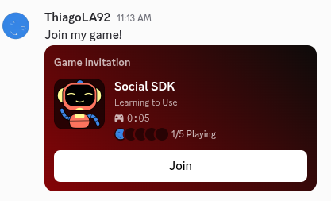

# Game Invites

## Send
!!! warning
	Prerequisites:

	- [Account linking](account_linking.md)
		- Using `DiscordClient.get_default_communication_scopes()`
	- [Rich Presence](rich_presence.md)
		- Using party
		- Using party secret
	- [Status](status.md)

	Any code from the prerequisites can be **omitted** to make it easier to read. If you do want the complete code, look at the [repository examples](https://github.com/thiagola92/discord-social-sdk/tree/main/demo/examples).  

Given that you made all prerequisites and your client status is ready, you can send an invite at any moment:  

```gdscript title="GDScript" linenums="1" hl_lines="6 26-28 31-33"
extends Node


var application_id: int = 123456789012345678

var target_id: int = 987654323109876543

var client := DiscordClient.new()


func _ready() -> void:
	client.set_application_id(application_id)
	client.set_status_changed_callback(_on_status_changed)


func _process(_delta: float) -> void:
	Discord.run_callbacks()


func _on_status_changed(status: DiscordClientStatus.Enum, _error: DiscordClientError.Enum, _error_detail: int) -> void:
	var enum_str: String = Discord.enum_to_string(status, DiscordClientStatus.id)
	
	print("Status changed to %s" % enum_str)
	
	if status == DiscordClientStatus.READY:
		var invite_message = "Join my game!"
		
		client.send_activity_invite(target_id, invite_message, _on_activity_invite_sent)


func _on_activity_invite_sent(result: DiscordClientResult) -> void:
	if result.successful():
		print("✉️ Invite sent!")
```

The other user will receive a direct message inviting to play.  

  

## Receive
You can configure for your game to be notified when the user receives an invite:  

```gdscript title="GDScript" linenums="1" hl_lines="11 18-24"
extends Node


var application_id: int = 123456789012345678

var client := DiscordClient.new()


func _ready() -> void:
	client.set_application_id(application_id)
	client.set_activity_invite_created_callback(_on_activity_invite_created)


func _process(_delta: float) -> void:
	Discord.run_callbacks()


func _on_activity_invite_created(invite: DiscordActivityInvite) -> void:
	print("Activity Invite received from user: %s" % invite.sender_id())
	
	var message: DiscordMessageHandle = client.get_message_handle(invite.message_id())
	
	if message:
		print("Invite Message: %s" % message.content())
```

Combining with the ability to accept invites, the user could do everything through your game:  

```gdscript title="GDScript" linenums="1" hl_lines="26 29-33"
extends Node


var application_id: int = 123456789012345678

var client := DiscordClient.new()


func _ready() -> void:
	client.set_application_id(application_id)
	client.set_activity_invite_created_callback(_on_activity_invite_created)


func _process(_delta: float) -> void:
	Discord.run_callbacks()


func _on_activity_invite_created(invite: DiscordActivityInvite) -> void:
	print("Activity Invite received from user: %s" % invite.sender_id())
	
	var message: DiscordMessageHandle = client.get_message_handle(invite.message_id())
	
	if message:
		print("Invite Message: %s" % message.content())
	
	client.accept_activity_invite(invite, _on_activity_invite_accepted)


func _on_activity_invite_accepted(result: DiscordClientResult, join_secret: String) -> void:
	if result.successful():
		print("Activity Invite accepted successfully! Secret: %s" % join_secret)
	else:
		print("❌ Activity Invite accept failed")
```

## Joined
You can be notified whenever the user joined a party.  

The advantage of configuring this, is that you will be notified whenever the user accept through the SDK (e.g. `client.accept_activity_invite()`) or Discord client (e.g. direct message).  

```gdscript title="GDScript" linenums="1" hl_lines="11 18 19"
extends Node


var application_id: int = 123456789012345678

var client := DiscordClient.new()


func _ready() -> void:
	client.set_application_id(application_id)
	client.set_activity_join_callback(_on_activity_joined)


func _process(_delta: float) -> void:
	Discord.run_callbacks()


func _on_activity_joined(join_secret: String) -> void:
	print("Joined activity! Secret: %s" % join_secret)
```

!!! tip

	Configure your game to be [launchable](launch.md) and set this callback before running `Discord.run_callbacks()`. This way you can be notified that you joined right after the game finished opening.  

## References
- [Managing Game Invites](https://docs.discord.com/developers/discord-social-sdk/development-guides/managing-game-invites)