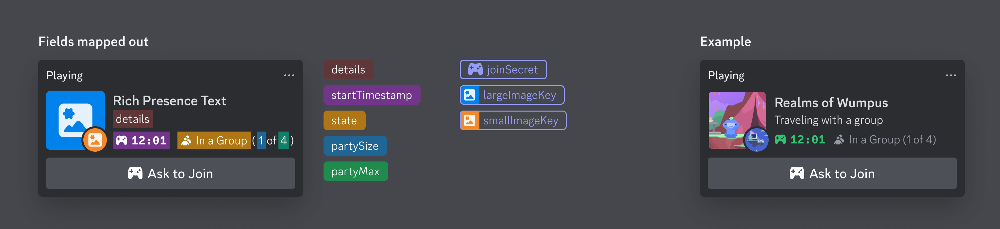
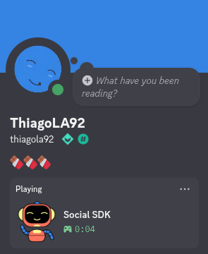
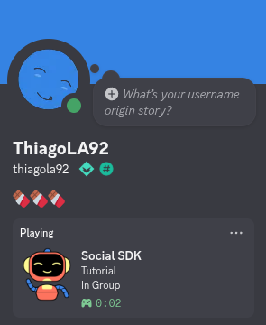
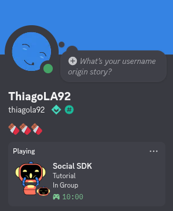
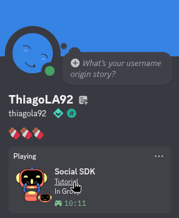
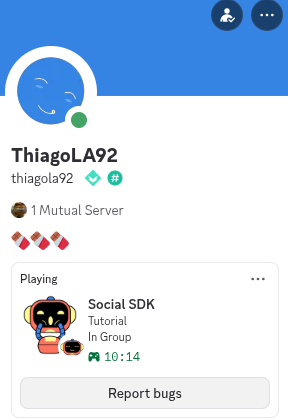
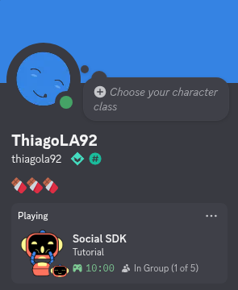

# Rich Presence
!!! warning
	Prerequisites:

	- [Account linking](account_linking.md)
		- If Discord is not running in the desktop

	Any code from the prerequisites can be **omitted** to make it easier to read. If you do want the complete code, look at the [repository examples](https://github.com/thiagola92/discord-social-sdk/tree/main/demo/examples).  

The [official documentation](https://docs.discord.com/developers/discord-social-sdk/development-guides/setting-rich-presence#understanding-rich-presence) explain which field. This is their image that summary the location of wich field:  

  

## Type
Define the type of your activity (playing, streaming, watching, ...):  

```gdscript title="GDScript" linenums="1" hl_lines="12 13 15 22-24"
extends Node


var application_id: int = 123456789012345678

var client := DiscordClient.new()


func _ready() -> void:
	client.set_application_id(application_id)
	
	var activity := DiscordActivity.new()
	activity.set_type(DiscordActivityTypes.PLAYING)

	client.update_rich_presence(activity, _on_rich_presence_updated)


func _process(_delta: float) -> void:
	Discord.run_callbacks()


func _on_rich_presence_updated(result: DiscordClientResult) -> void:
	if result.successful():
		print("✅ Rich presence updated!")
```

  

## Details and State
Details is the main description of what the player is doing in the game (Quick Match, Ranked, ARAM) and state is a secondary description inside that context (In Queue, In Match, In a group).  

```gdscript title="GDScript" linenums="1" hl_lines="15 16"
extends Node


var application_id: int = 123456789012345678

var client := DiscordClient.new()


func _ready() -> void:
	client.set_application_id(application_id)
	
	var activity := DiscordActivity.new()
	activity.set_type(DiscordActivityTypes.PLAYING)

	activity.set_details("Tutorial")
	activity.set_state("In Group")

	client.update_rich_presence(activity, _on_rich_presence_updated)


func _process(_delta: float) -> void:
	Discord.run_callbacks()


func _on_rich_presence_updated(result: DiscordClientResult) -> void:
	if result.successful():
		print("✅ Rich presence updated!")
```

  

## Timestamps
Can be used to tell others for how long the user is doing that activity or when it will end (`set_end()`).  

```gdscript title="GDScript" linenums="1" hl_lines="18-21"
extends Node


var application_id: int = 123456789012345678

var client := DiscordClient.new()


func _ready() -> void:
	client.set_application_id(application_id)
	
	var activity := DiscordActivity.new()
	activity.set_type(DiscordActivityTypes.PLAYING)

	activity.set_details("Tutorial")
	activity.set_state("In Group")
	
	var timestamps := DiscordActivityTimestamps.new()
	var ten_minutes_ago: int = int(Time.get_unix_time_from_system() - 600)
	timestamps.set_start(ten_minutes_ago * 1000)
	activity.set_timestamps(timestamps)

	client.update_rich_presence(activity, _on_rich_presence_updated)


func _process(_delta: float) -> void:
	Discord.run_callbacks()


func _on_rich_presence_updated(result: DiscordClientResult) -> void:
	if result.successful():
		print("✅ Rich presence updated!")
```

!!! note
	Discord expects the time in milliseconds, while Godot `Time` gives you in seconds.  

  

## Assets
If you setted assets through the Discord Developer Portal, you can use them here to change some images as you need.  

```gdscript title="GDScript" linenums="1" hl_lines="23-29"
extends Node


var application_id: int = 123456789012345678

var client := DiscordClient.new()


func _ready() -> void:
	client.set_application_id(application_id)
	
	var activity := DiscordActivity.new()
	activity.set_type(DiscordActivityTypes.PLAYING)

	activity.set_details("Tutorial")
	activity.set_state("In Group")
	
	var timestamps := DiscordActivityTimestamps.new()
	var ten_minutes_ago: int = int(Time.get_unix_time_from_system() - 600)
	timestamps.set_start(ten_minutes_ago * 1000)
	activity.set_timestamps(timestamps)
	
	var assets := DiscordActivityAssets.new()
	assets.set_large_image("surprise")
	assets.set_large_text("Surprise")
	assets.set_small_image("happy-face")
	assets.set_small_text("Happy face")
	assets.set_invite_cover_image("thumbnail")
	activity.set_assets(assets)

	client.update_rich_presence(activity, _on_rich_presence_updated)


func _process(_delta: float) -> void:
	Discord.run_callbacks()


func _on_rich_presence_updated(result: DiscordClientResult) -> void:
	if result.successful():
		print("✅ Rich presence updated!")
```

  

## Field URLs
Some fields can be turned in links.  

```gdscript title="GDScript" linenums="1" hl_lines="31 32"
extends Node


var application_id: int = 123456789012345678

var client := DiscordClient.new()


func _ready() -> void:
	client.set_application_id(application_id)
	
	var activity := DiscordActivity.new()
	activity.set_type(DiscordActivityTypes.PLAYING)

	activity.set_details("Tutorial")
	activity.set_state("In Group")
	
	var timestamps := DiscordActivityTimestamps.new()
	var ten_minutes_ago: int = int(Time.get_unix_time_from_system() - 600)
	timestamps.set_start(ten_minutes_ago * 1000)
	activity.set_timestamps(timestamps)
	
	var assets := DiscordActivityAssets.new()
	assets.set_large_image("surprise")
	assets.set_large_text("Surprise")
	assets.set_small_image("happy-face")
	assets.set_small_text("Happy face")
	assets.set_invite_cover_image("thumbnail")
	activity.set_assets(assets)
	
	activity.set_details_url("https://github.com/thiagola92/discord-social-sdk/tree/main")
	activity.set_state_url("https://store.godotengine.org/asset/thiagola92/discord-social-sdk/")

	client.update_rich_presence(activity, _on_rich_presence_updated)


func _process(_delta: float) -> void:
	Discord.run_callbacks()


func _on_rich_presence_updated(result: DiscordClientResult) -> void:
	if result.successful():
		print("✅ Rich presence updated!")
```

  

## Buttons
It's possible to add up to two buttons (normally they are links like "Buy on Steam!").  

```gdscript title="GDScript" linenums="1" hl_lines="34-37"
extends Node


var application_id: int = 123456789012345678

var client := DiscordClient.new()


func _ready() -> void:
	client.set_application_id(application_id)
	
	var activity := DiscordActivity.new()
	activity.set_type(DiscordActivityTypes.PLAYING)

	activity.set_details("Tutorial")
	activity.set_state("In Group")
	
	var timestamps := DiscordActivityTimestamps.new()
	var ten_minutes_ago: int = int(Time.get_unix_time_from_system() - 600)
	timestamps.set_start(ten_minutes_ago * 1000)
	activity.set_timestamps(timestamps)
	
	var assets := DiscordActivityAssets.new()
	assets.set_large_image("surprise")
	assets.set_large_text("Surprise")
	assets.set_small_image("happy-face")
	assets.set_small_text("Happy face")
	assets.set_invite_cover_image("thumbnail")
	activity.set_assets(assets)
	
	activity.set_details_url("https://github.com/thiagola92/discord-social-sdk/tree/main")
	activity.set_state_url("https://store.godotengine.org/asset/thiagola92/discord-social-sdk/")
	
	var issue_button := DiscordActivityButton.new()
	issue_button.set_label("Report bugs")
	issue_button.set_url("https://github.com/thiagola92/discord-social-sdk/issues")
	activity.add_button(issue_button)

	client.update_rich_presence(activity, _on_rich_presence_updated)


func _process(_delta: float) -> void:
	Discord.run_callbacks()


func _on_rich_presence_updated(result: DiscordClientResult) -> void:
	if result.successful():
		print("✅ Rich presence updated!")
```

  

!!! note "Buttons are only visible to others"
	Use a secondary account to see or ask a friend to print screen (which one is easier for you).  

## Status Text
```gdscript title="GDScript" linenums="1" hl_lines="39"
extends Node


var application_id: int = 123456789012345678

var client := DiscordClient.new()


func _ready() -> void:
	client.set_application_id(application_id)
	
	var activity := DiscordActivity.new()
	activity.set_type(DiscordActivityTypes.PLAYING)

	activity.set_details("Tutorial")
	activity.set_state("In Group")
	
	var timestamps := DiscordActivityTimestamps.new()
	var ten_minutes_ago: int = int(Time.get_unix_time_from_system() - 600)
	timestamps.set_start(ten_minutes_ago * 1000)
	activity.set_timestamps(timestamps)
	
	var assets := DiscordActivityAssets.new()
	assets.set_large_image("surprise")
	assets.set_large_text("Surprise")
	assets.set_small_image("happy-face")
	assets.set_small_text("Happy face")
	assets.set_invite_cover_image("thumbnail")
	activity.set_assets(assets)
	
	activity.set_details_url("https://github.com/thiagola92/discord-social-sdk/tree/main")
	activity.set_state_url("https://store.godotengine.org/asset/thiagola92/discord-social-sdk/")
	
	var issue_button := DiscordActivityButton.new()
	issue_button.set_label("Report bugs")
	issue_button.set_url("https://github.com/thiagola92/discord-social-sdk/issues")
	activity.add_button(issue_button)

	activity.set_status_display_type(DiscordStatusDisplayTypes.STATE)

	client.update_rich_presence(activity, _on_rich_presence_updated)


func _process(_delta: float) -> void:
	Discord.run_callbacks()


func _on_rich_presence_updated(result: DiscordClientResult) -> void:
	if result.successful():
		print("✅ Rich presence updated!")
```

## Party
Inform others about your party/group state. 

Do not forget that you can change the message that appears before the party size through `set_state()`.  

```gdscript title="GDScript" linenums="1" hl_lines="41-45"
extends Node


var application_id: int = 123456789012345678

var client := DiscordClient.new()


func _ready() -> void:
	client.set_application_id(application_id)
	
	var activity := DiscordActivity.new()
	activity.set_type(DiscordActivityTypes.PLAYING)

	activity.set_details("Tutorial")
	activity.set_state("In Group")
	
	var timestamps := DiscordActivityTimestamps.new()
	var ten_minutes_ago: int = int(Time.get_unix_time_from_system() - 600)
	timestamps.set_start(ten_minutes_ago * 1000)
	activity.set_timestamps(timestamps)
	
	var assets := DiscordActivityAssets.new()
	assets.set_large_image("surprise")
	assets.set_large_text("Surprise")
	assets.set_small_image("happy-face")
	assets.set_small_text("Happy face")
	assets.set_invite_cover_image("thumbnail")
	activity.set_assets(assets)
	
	activity.set_details_url("https://github.com/thiagola92/discord-social-sdk/tree/main")
	activity.set_state_url("https://store.godotengine.org/asset/thiagola92/discord-social-sdk/")
	
	var issue_button := DiscordActivityButton.new()
	issue_button.set_label("Report bugs")
	issue_button.set_url("https://github.com/thiagola92/discord-social-sdk/issues")
	activity.add_button(issue_button)

	activity.set_status_display_type(DiscordStatusDisplayTypes.STATE)
	
	var party := DiscordActivityParty.new()
	party.set_id("party1234")
	party.set_current_size(1)
	party.set_max_size(5)
	activity.set_party(party)

	client.update_rich_presence(activity, _on_rich_presence_updated)


func _process(_delta: float) -> void:
	Discord.run_callbacks()


func _on_rich_presence_updated(result: DiscordClientResult) -> void:
	if result.successful():
		print("✅ Rich presence updated!")
```

  

## Party Secret
Secrets are used to pass information to people that want to join you in the game/party/group.  
The section [Game Invites](game_invites.md) will show how is used.  

!!! warning "At the moment buttons doesn't work while you are using party secrets."

```gdscript title="GDScript" linenums="1" hl_lines="34-37 47-50"
extends Node


var application_id: int = 123456789012345678

var client := DiscordClient.new()


func _ready() -> void:
	client.set_application_id(application_id)
	
	var activity := DiscordActivity.new()
	activity.set_type(DiscordActivityTypes.PLAYING)

	activity.set_details("Tutorial")
	activity.set_state("In Group")
	
	var timestamps := DiscordActivityTimestamps.new()
	var ten_minutes_ago: int = int(Time.get_unix_time_from_system() - 600)
	timestamps.set_start(ten_minutes_ago * 1000)
	activity.set_timestamps(timestamps)
	
	var assets := DiscordActivityAssets.new()
	assets.set_large_image("surprise")
	assets.set_large_text("Surprise")
	assets.set_small_image("happy-face")
	assets.set_small_text("Happy face")
	assets.set_invite_cover_image("thumbnail")
	activity.set_assets(assets)
	
	activity.set_details_url("https://github.com/thiagola92/discord-social-sdk/tree/main")
	activity.set_state_url("https://store.godotengine.org/asset/thiagola92/discord-social-sdk/")
	
	#var issue_button := DiscordActivityButton.new()
	#issue_button.set_label("Report bugs")
	#issue_button.set_url("https://github.com/thiagola92/discord-social-sdk/issues")
	#activity.add_button(issue_button)

	activity.set_status_display_type(DiscordStatusDisplayTypes.STATE)
	
	var party := DiscordActivityParty.new()
	party.set_id("party1234")
	party.set_current_size(1)
	party.set_max_size(5)
	activity.set_party(party)

	# Cannot be used with buttons.
	var secrets := DiscordActivitySecrets.new()
	secrets.set_join("your-join-secret")
	activity.set_secrets(secrets)

	client.update_rich_presence(activity, _on_rich_presence_updated)


func _process(_delta: float) -> void:
	Discord.run_callbacks()


func _on_rich_presence_updated(result: DiscordClientResult) -> void:
	if result.successful():
		print("✅ Rich presence updated!")
```

## References
- [Setting Rich Presence](https://docs.discord.com/developers/discord-social-sdk/development-guides/setting-rich-presence)