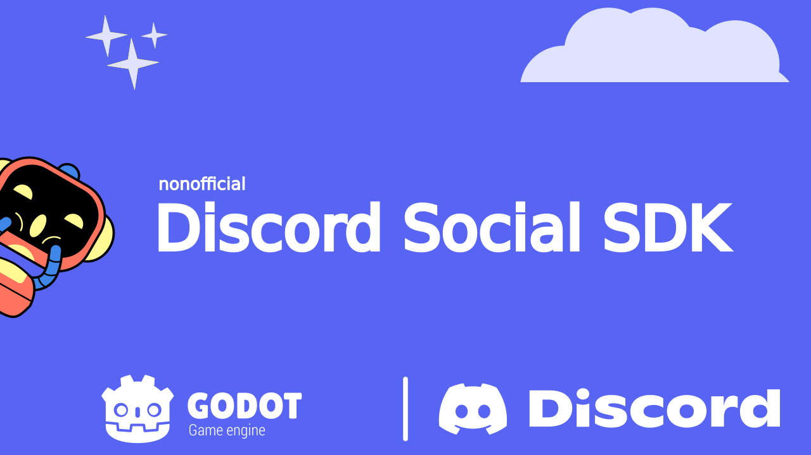

# Discord Social SDK
(nonofficial)

  

## What is this GDExtension?
It's a wrapper around the [Discord Social SDK](https://discord.com/developers/social-sdk), so you can interact with the SDK through GDScript (instead of C++).  

## What is Discord Social SDK?
It's a way to use Discord infrastructure in your game. Instead of developing a text/voice chat for your game, you could just request Discord to create one of them for you.  

You can read more about it from Discord it self:  

- [Introducing the Discord Social SDK](https://support-dev.discord.com/hc/en-us/articles/30127085446039-Introducing-the-Discord-Social-SDK)  
- [Discord Social SDK Overview](https://discord.com/developers/docs/discord-social-sdk/overview)  
- [Discord Social SDK Reference](https://discord.com/developers/docs/social-sdk/index.html)  

## What can you do with this GDExtension?  
In theory, everything that the SDK can do!  

- Send/Accept friend request.  
- Block/Unblock users.  
- Send/Read direct messages.  
- Interact with [Rich Presence](https://discord.com/developers/docs/rich-presence/overview).  
    - Setup your Activity.  
    - Invite to game.  
- Create lobbies.  
    - Use lobby text chat.  
    - Use lobby voice chat.  
- ... I don't know all functionalities

!!! warning
    **Did I test if everything is working?** No.  
    **Will I test if everything is working?** No.  

# Development
For development details go to [DEVELOPMENT.md](./DEVELOPMENT.md).  
